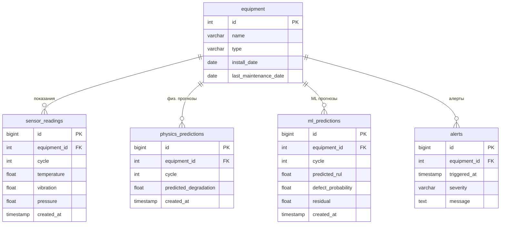

## Стек технологий
Язык (backend): Python  
Язык (frontend): TypeScript  
ML/DL: PyTorch, XGBoost  
Вычисления: NumPy, SciPy  
Backend: FastAPI  
Frontend: React  
База данных: PostgreSQL  
Инструменты автоматизации: Ollama  

## Определение проблемы и формулировка темы
Промышленные предприятия вынуждены проводить плановое техническое обслуживание оборудования по жёсткому графику, даже когда оборудование находится в исправном состоянии. Это приводит к избыточным затратам на человеческие ресурсы и простоям производства. При этом отказ от планового обслуживания в пользу обслуживания «по факту поломки» несёт риск внезапных аварий.  В результате предприятия вынуждены выбирать между переплатой за избыточное обслуживание и риском пропустить развивающийся дефект.

## User Stories
1. Как инженер по эксплуатации, я хочу видеть текущий прогноз остаточного ресурса (RUL) каждой единицы оборудования, чтобы планировать техобслуживание по факту приближающегося дефекта, а не по жёсткому графику.

2. Как ответственный за производство, я хочу получать уведомление, когда состояние оборудования становится критическим, чтобы оперативно среагировать до внеплановой остановки или аварии.

3. Как инженер по эксплуатации, я хочу видеть историю показаний датчиков и отклонений от физически ожидаемого поведения оборудования, чтобы понимать, как развивался дефект, и точнее диагностировать его причину.

## Масштаб системы
Целевая аудитория системы - инженеры по эксплуатации и ответственные за производство на промышленных предприятиях. При оценке масштаба в 10 000 уникальных пользователей в сутки предполагается, что система обслуживает порядка N предприятий с M единицами оборудования на каждом, где каждый пользователь в среднем совершает K запросов в день (просмотр дашборда, проверка истории, получение алертов). Основная нагрузка - read-запросы (просмотр данных), запись происходит асинхронно от симулятора/датчиков оборудования, а не от действий пользователей напрямую.

## Отказоустойчивость
При недоступности Telegram Bot API система применяет паттерн Circuit Breaker: после 3 неудачных попыток отправки подряд прекращает попытки на 60 секунд, чтобы не тратить ресурсы на заведомо неудачные запросы. Алерт при этом всё равно сохраняется в базу данных и отображается в интерфейсе.

При недоступности Open-Meteo API физическая модель использует последнее закэшированное значение погодных условий (кэш на 1 час). Если кэш пуст (например, при первом запуске) - модель работает без погодного фактора.

## Анализ нагрузок
### 1. READ / WRITE нагрузка.
Исходные допущения:
| Параметр | Значение | Почему |
|---|---|---|
| Пользователей в сутки | 10 000 | — |
| Единиц оборудования в системе | 1 000 | условно |
| Частота показаний датчика | 1 раз / 30 сек | типично для промышленного мониторинга |
| Частота инференса модели | 1 раз / 5 мин на единицу | нет смысла считать прогноз чаще, чем меняются данные |
| Запросов пользователя за сессию | ~5-10 (дашборд + история + алерты) | из прошлой оценки RPS |

WRITE в БД идет не от пользователей, а от фонового simulator + ml / physics predictions: 1 000 / 30 + 1 000 / 300 + 1 000 / 300 ~40 записей в сек  
READ 10 000 * 8 запросов ~ 80 000, правило 80%/20%, 20% от 24 часов = ~5, 80% от 80 000 = 64 000, 64 000 / (5 * 3600) ~ 3.5 RPS в пик

### 2. Объём сетевого трафика
Средний размер JSON-ответа:  ~10 КБ  
Запросов в сутки: 10 000 польз. × 8 запросов ≈ 80 000 запросов/сутки  
Трафик: 80 000 × 10 КБ ≈ 800 МБ/сутки ≈ ~24 ГБ/месяц  

### 3. Расчет объемов дисковой системы с учетом требования по хранению данных за период > 5 лет
Показания счетчиков:  
33 записи/сек × 86 400 сек = ~2.88 млн строк/сутки  
Размер строки ≈ 80 байт  
2.88 млн × 80 байт ≈ 230 МБ/сутки → ~84 ГБ/год → ~420 ГБ за 5 лет  

Предсказания модели:  
6.6 записи/сек × 86 400 = ~570 тыс. строк/сутки. 
570 тыс. × 50 байт ≈ 28.5 МБ/сутки → ~10 ГБ/год → ~52 ГБ за 5 лет. 

## Архитектурные схемы
### Context 

### Container

## Контракты API
### Оборудование 
| Метод | Эндпоинт | Описание | Ожидаемый latency |
|---|---|---|---|
| GET | `/equipment` | Список всех единиц оборудования | < 200 мс |
| GET | `/equipment/{id}` | Информация об одной единице | < 100 мс |
| GET | `/equipment/{id}/status` | Текущее состояние | < 150 мс |
| GET | `/equipment/{id}/history` | История показаний датчиков за период | < 500 мс |
| GET | `/equipment/{id}/forecast` | Прогноз деградации | < 500 мс |

### Алерты 
| Метод | Эндпоинт | Описание | Ожидаемый latency |
|---|---|---|---|
| GET | `/alerts` | Список последних алертов | < 200 мс |
| GET | `/alerts/{equipment_id}` | Алерты по конкретному оборудованию | < 200 мс |

### Прогнозирование 
| Метод | Эндпоинт | Описание | Ожидаемый latency |
|---|---|---|---|
| POST | `/predict` | Ручной запрос инференса модели для конкретного оборудования | < 2000 мс |

## Проектирование данных

При записи (40 записей/сек) все вставки идут в разные таблицы от фоновых процессов. 40 INSERT/сек — незначительная нагрузка для PostgreSQL.  
При чтении (~10-20 RPS) PostgreSQL будет находить строки за O(log n). Проблем не возникнет. 

## Стратегия масштабирования
### 1. Backend (FastAPI)
При 100 000 — запускаем несколько экземпляров за балансировщиком нагрузки.

### 2. База данных
Основная нагрузка — чтение (дашборд, история, алерты).
Добавляем 1-2 read-реплики, куда направляем все GET-запросы. 
Запись идёт только в primary

### 3. Кэширование
Часто запрашиваемые данные кэшируем в Redis, чтобы не ходить
в Postgres на каждый запрос

### 4. Кэширование внешних API
__Open-Meteo API:__
Погодные данные меняются медленно - нет смысла запрашивать чаще
раза в час. Кэшируем ответ в Redis.

__Telegram Bot API:__
Алертов немного, rate limit маловероятен.

### 5. Ml / Physics engine
- Запускаем несколько воркеров ML-engine параллельно,
  каждый обрабатывает свой диапазон `equipment_id`
- Если CPU не хватает - батчинг: вместо инференса
  по одной единице за раз, модель обрабатывает пачку, что намного эффективнее.

